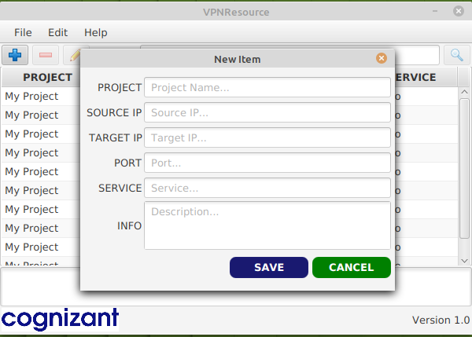

# VPNResource

<h3>Features</h3>

<ul>
  <li>add</li>
  <li>remove</li>
  <li>update</li>
  <li>delete</li>
  <li>search</li>
  <li>Import/Export File</li>
</ul>

# Home

  
  

    The app will show all the ips in a table which makes it easy to seach what we are looking for. 
  

# Adding

  The user will be able to add a new item by clicking on the plus button.

# Exporting

    The application allows the user to export the data to a new file. 

